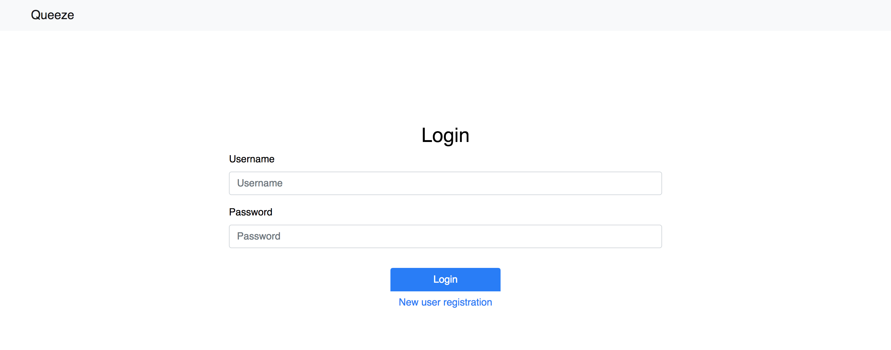
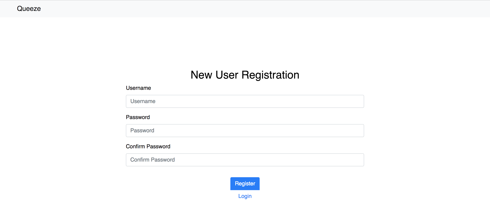
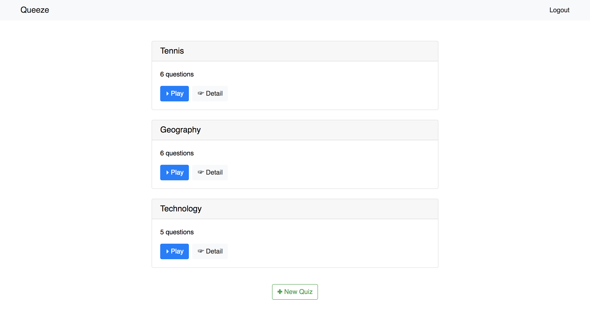
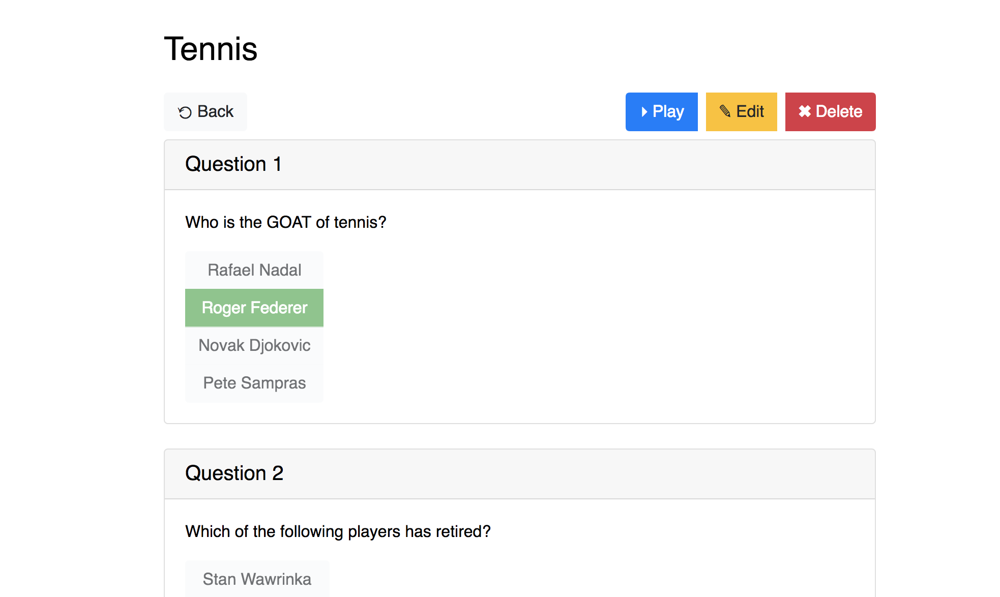
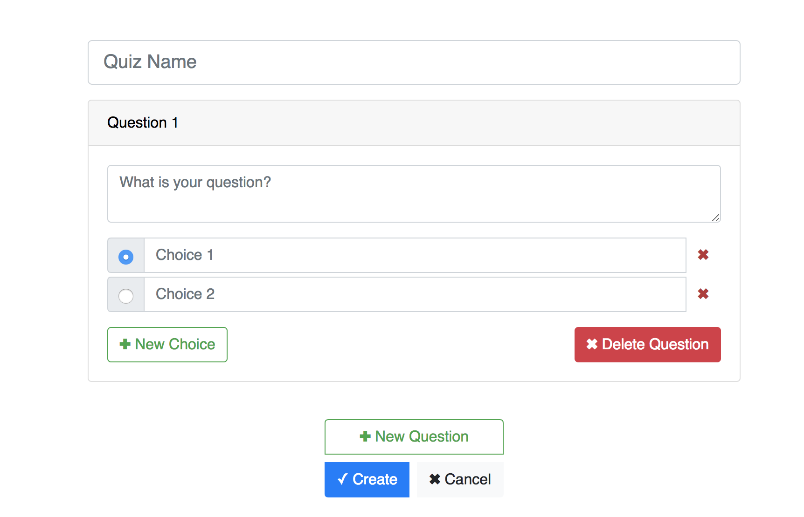
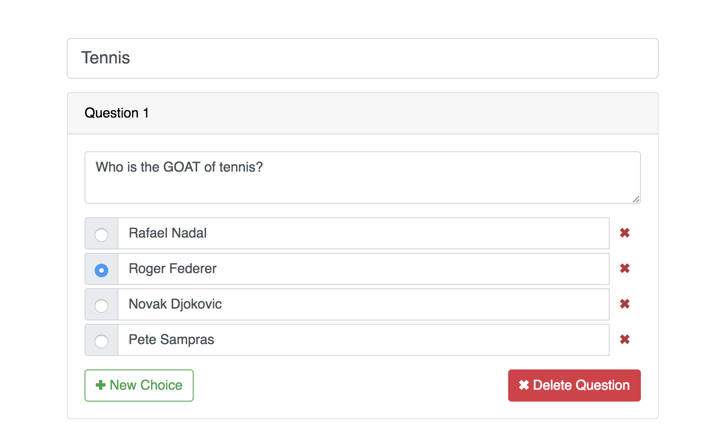
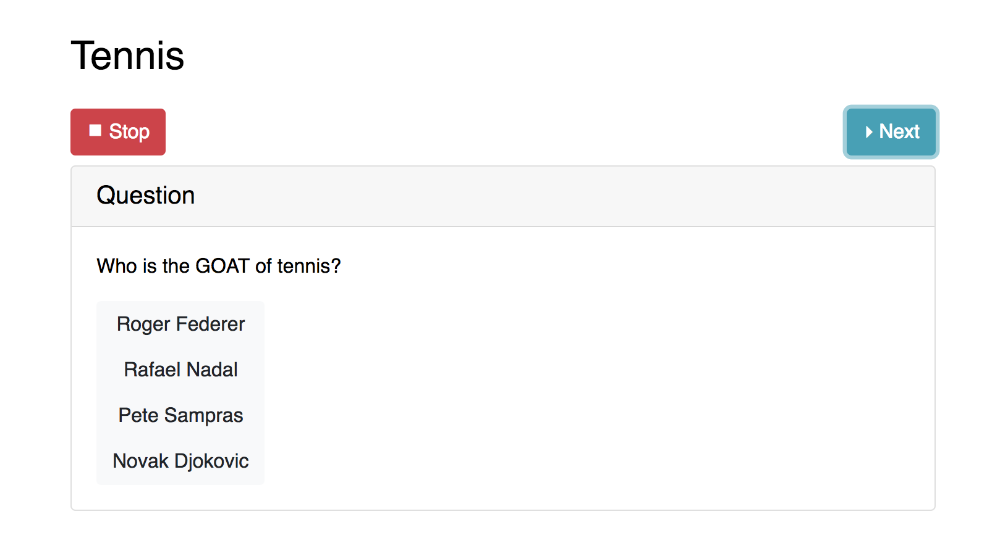
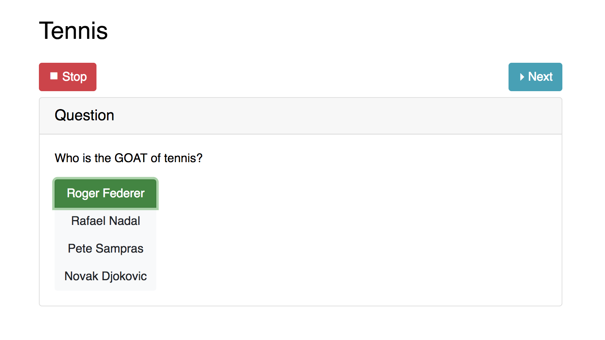
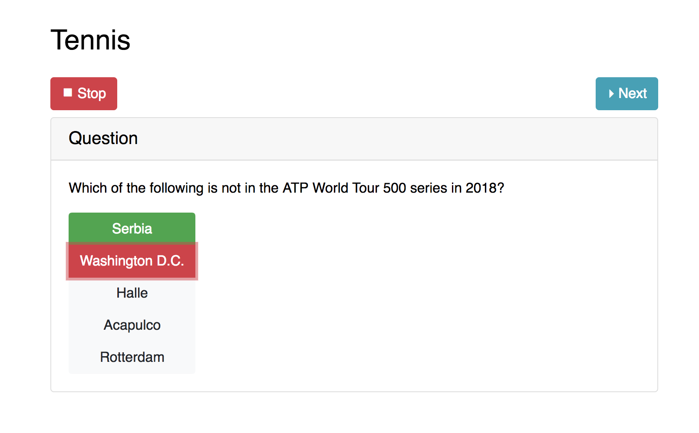

# Queeze

A Quiz app built on React &amp; Redux.  
A backend server accompanies: https://github.com/pyliaorachel/queeze-backend

Starter code: https://github.com/btg5679/react-redux-prod-starter.

## Features

- Login/registration
- Quiz view/create/edit/delete
- Play quiz
  - Question random
  - Choice shuffled
  - Single answer

## Usage

```bash
# Download project
$ git clone https://github.com/pyliaorachel/queeze.git

# Install dependencies
$ npm install

# Run development server
$ npm run dev

# Run production server
$ npm run build
$ npm start
```

## Pages

Login                      |  Registration
:-------------------------:|:-------------------------:
       |  

Quiz List                  |  Quiz Details
:-------------------------:|:-------------------------:
   |  

New Quiz                   |  Edit Quiz
:-------------------------:|:-------------------------:
    |  

Play Quiz                  |  Correct Answer           |  Wrong Answer
:-------------------------:|:-------------------------:|:-------------------------:
   ||  
